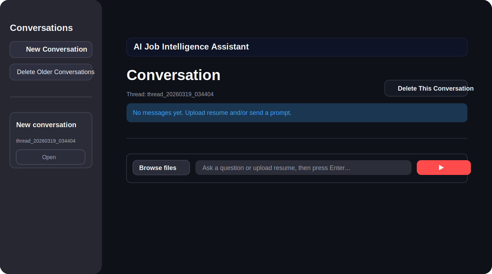
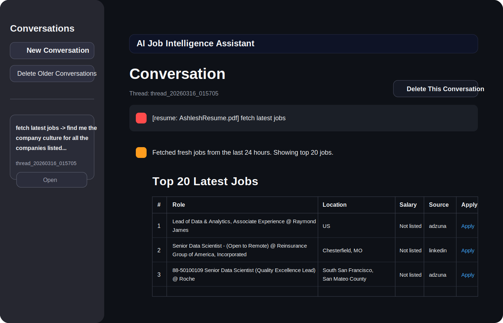

# Career Intel Assistant

[](https://www.python.org/)
[](https://streamlit.io/)
[](https://docs.pytest.org/)
[](https://github.com/Ashleshupganlawar/career-intel-assistant)

Career Intel Assistant is a Streamlit app for resume-aware job discovery and company research. It combines structured resume parsing, hybrid job matching, threaded chat, and retrieval-augmented generation (RAG) over curated company profile data to help users move from job search to company insight in one workspace.

## Product Preview

### Empty conversation state



### Job results and conversation view



## Why This Project

Job search tools usually split the workflow across multiple tabs: one place for resumes, another for job boards, and another for company research. This project brings those pieces together into a single assistant that can:

- parse a resume into a usable candidate profile
- fetch and rank jobs using both lexical and embedding-style signals
- keep thread context so follow-up questions stay grounded
- surface company culture, hiring, and interview context from curated local data
- generate practical responses without losing deterministic evidence

## Core Features

- Resume-aware matching that derives search queries from roles and skills
- Hybrid ranking engine that blends lexical overlap and vector-style similarity
- Threaded Streamlit chat experience for iterative job exploration
- RAG-backed company insights powered by local source maps and vector store assets
- Reproducible storage for candidates, conversations, jobs, and match artifacts

## How It Works

1. The user uploads a resume or sends a prompt through the Streamlit UI.
2. The resume parser extracts normalized roles, skills, and raw profile text.
3. The chat graph pipeline derives a search query and refreshes recent jobs.
4. The matching engine ranks jobs against the candidate profile.
5. The RAG layer retrieves relevant company context from processed sources and vector data.
6. The assistant responds with ranked jobs, supporting context, and follow-up guidance inside the same thread.

## Architecture

- `app/streamlit_app.py`: Streamlit UI and interaction flow
- `src/job_intel/chat/`: Graph pipeline and chat orchestration
- `src/job_intel/matching/`: Hybrid job ranking logic
- `src/job_intel/rag/`: Local retriever and vector store helpers
- `src/job_intel/resume/`: Resume parsing utilities
- `src/job_intel/jobs/`: Job source connectors and service layer
- `src/job_intel/storage/`: Conversation and artifact persistence
- `data/`: Source maps, processed company profiles, caches, and vector DB assets
- `scripts/`: Data prep and maintenance utilities
- `tests/`: Unit and integration coverage

## Quick Start

### 1. Create an environment

```bash
python3 -m venv .venv
source .venv/bin/activate
pip install -r requirements.txt
```

### 2. Configure environment variables

Create a `.env` file for API-backed features.

```bash
OPENAI_API_KEY=your_key_here
OPENAI_MODEL=gpt-4o-mini
OPENAI_RESUME_MODEL=gpt-4o-mini
```

### 3. Run the app

```bash
streamlit run app/streamlit_app.py
```

Open the local Streamlit URL shown in the terminal.

## Development

Run tests:

```bash
pytest -q
```

Useful docs:

- `docs/codex_workflow.md`
- `docs/mcp_job_sources.md`
- `docs/vector_db_workflow.md`

Useful scripts:

- `scripts/build_vector_db.py`
- `scripts/fetch_and_store_sources.py`
- `scripts/summarize_company_profiles.py`
- `scripts/query_vector_db.py`

## Repository Notes

- The repo includes curated company profile and vector store assets so the app has useful local context out of the box.
- Local secrets, caches, and machine-specific files are excluded through `.gitignore`.
- The preview images in this README are lightweight SVG recreations based on the current UI so the landing page stays self-contained in the repo.

## Roadmap

- Add richer job filters and sorting controls
- Expand company evidence coverage and freshness workflows
- Add a short product walkthrough GIF or video capture
- Improve evaluation around resume parsing and ranking quality
