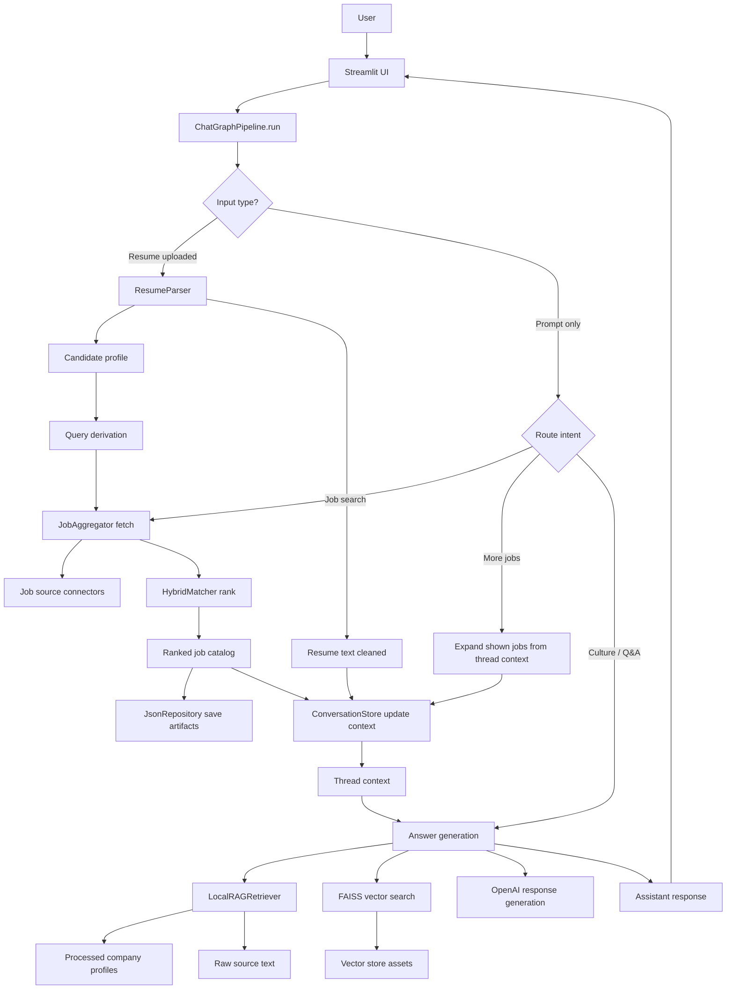

# Career Intel Assistant

[](https://www.python.org/)
[](https://streamlit.io/)
[](https://docs.pytest.org/)
[](https://github.com/Ashleshupganlawar/career-intel-assistant)

Career Intel Assistant is a Streamlit app for resume-aware job discovery and company research. It combines structured resume parsing, hybrid job matching, threaded chat, and retrieval-augmented generation (RAG) over curated company profile data to help users move from job search to company insight in one workspace.

## Product Preview

### Empty conversation state


### Job results and conversation view


## Why This Project

Job search tools usually split the workflow across multiple tabs: one place for resumes, another for job boards, and another for company research. This project brings those pieces together into a single assistant that can:

- parse a resume into a usable candidate profile
- fetch and rank jobs using both lexical and embedding-style signals
- keep thread context so follow-up questions stay grounded
- surface company culture, hiring, and interview context from curated local data
- generate practical responses without losing deterministic evidence

## Core Features

- Resume-aware matching that derives search queries from roles and skills
- Hybrid ranking engine that blends lexical overlap and vector-style similarity
- Threaded Streamlit chat experience for iterative job exploration
- RAG-backed company insights powered by local source maps and vector store assets
- Reproducible storage for candidates, conversations, jobs, and match artifacts

## Workflow

```text
Upload Resume / Enter Prompt
          ->
Resume Parsing and Candidate Extraction
          ->
Query Derivation and Fresh Job Fetch
          ->
Hybrid Match Ranking
          ->
RAG-Based Company Context Retrieval
          ->
Threaded Assistant Response
          ->
Follow-up Questions, More Jobs, and Company Insight Exploration
```

This is the practical flow inside the app:

1. The user starts in the Streamlit chat UI by uploading a resume, typing a prompt, or both.
2. The pipeline extracts resume text and converts it into a normalized candidate profile.
3. The app derives a likely search query from parsed skills and roles.
4. Job connectors fetch recent postings and the matcher ranks them for candidate fit.
5. The RAG layer pulls relevant company evidence from local profiles, source maps, and vector search.
6. The assistant returns a grounded response inside the same conversation thread.
7. The user can keep asking follow-up questions like "show more jobs" or "what is the company culture?"

## Tech Stack

- `Python`
  Main application language for orchestration, ranking, retrieval, parsing, and data processing.
- `Streamlit`
  Used to build the chat-style interface quickly and turn the project into an interactive AI product instead of only a backend script.
- `OpenAI API`
  Used for LLM-assisted resume parsing and assistant responses when API credentials are available.
- `FAISS`
  Powers local vector retrieval for company context and helps the RAG flow surface relevant evidence efficiently.
- `Pytest`
  Provides unit and integration coverage so core behavior can be verified as the project evolves.
- `JSON-based local persistence`
  Keeps conversations, candidates, jobs, and match outputs reproducible and easy to inspect during development.
- `Hybrid ranking logic`
  Combines lexical overlap with TF-IDF/cosine-style semantic similarity so ranking is more robust than keyword search alone.
- `RAG architecture`
  Grounds assistant answers in curated company knowledge rather than relying only on model memory.

## How It Works

1. The user uploads a resume or sends a prompt through the Streamlit UI.
2. The resume parser extracts normalized roles, skills, and raw profile text.
3. The chat graph pipeline derives a search query and refreshes recent jobs.
4. The matching engine ranks jobs against the candidate profile.
5. The RAG layer retrieves relevant company context from processed sources and vector data.
6. The assistant responds with ranked jobs, supporting context, and follow-up guidance inside the same thread.

## Architecture



- `app/streamlit_app.py`: Streamlit UI and interaction flow
- `src/job_intel/chat/`: Graph pipeline and chat orchestration
- `src/job_intel/matching/`: Hybrid job ranking logic
- `src/job_intel/rag/`: Local retriever and vector store helpers
- `src/job_intel/resume/`: Resume parsing utilities
- `src/job_intel/jobs/`: Job source connectors and service layer
- `src/job_intel/storage/`: Conversation and artifact persistence
- `data/`: Source maps, processed company profiles, caches, and vector DB assets
- `scripts/`: Data prep and maintenance utilities
- `tests/`: Unit and integration coverage

## Demo Walkthrough

### 1. Resume upload with job search

Prompt:
`[upload resume] fetch latest jobs`

What the app returns:
- Extracts candidate roles and skills from the resume
- Pulls recent job postings
- Ranks the top matches and shows them in the thread

### 2. Follow-up for more results

Prompt:
`show more jobs`

What the app returns:
- Uses the same thread context instead of starting over
- Expands the visible ranked job list
- Keeps the original resume and search context active

### 3. Company insight follow-up

Prompt:
`what is the company culture and hiring process for these companies?`

What the app returns:
- Retrieves relevant company evidence from local profiles and vector search
- Summarizes hiring signals, culture themes, and interview context
- Responds in the same conversation so the answer stays grounded in the fetched job list

## Quick Start

### 1. Create an environment

```bash
python3 -m venv .venv
source .venv/bin/activate
pip install -r requirements.txt
```

### 2. Configure environment variables

Create a `.env` file for API-backed features.

```bash
OPENAI_API_KEY=your_key_here
OPENAI_MODEL=gpt-4o-mini
OPENAI_RESUME_MODEL=gpt-4o-mini
```

### 3. Run the app

```bash
streamlit run app/streamlit_app.py
```

Open the local Streamlit URL shown in the terminal.

## Development

Run tests:

```bash
pytest -q
```

Useful docs:

- `docs/codex_workflow.md`
- `docs/mcp_job_sources.md`
- `docs/vector_db_workflow.md`

Useful scripts:

- `scripts/build_vector_db.py`
- `scripts/fetch_and_store_sources.py`
- `scripts/summarize_company_profiles.py`
- `scripts/query_vector_db.py`

## What This Project Helps You Learn

- How to build an end-to-end AI application, not just a standalone model demo
- How resume parsing can feed downstream search, ranking, and personalized assistant behavior
- How RAG improves answer grounding by connecting LLM responses to retrievable evidence
- How deterministic components and LLM components can complement each other in one workflow
- How to organize a modular Python codebase with separate UI, orchestration, matching, retrieval, and storage layers
- How local vector search and curated datasets can support explainable AI product behavior
- How tests help protect AI-adjacent logic like ranking, parsing, storage, and retrieval from regressions

If you are learning AI engineering, this project is useful because it touches several real product patterns at once: UI integration, LLM orchestration, retrieval, ranking, persistence, and evaluation-friendly structure.

## Challenges Faced and Solutions

- `Balancing deterministic logic with LLM flexibility`
  The project needs reliable job ranking and storage behavior, but also benefits from natural-language understanding and resume extraction. The solution was to keep ranking, retrieval, and persistence deterministic while using LLMs as optional assistants for parsing and response generation.
- `Keeping responses grounded instead of generic`
  A career assistant can easily drift into vague advice. The solution was to add RAG over curated company profiles, source maps, raw source text, and vector search so answers can be tied back to retrievable evidence.
- `Turning resume text into useful downstream signals`
  Raw resume text is noisy and not directly usable for matching. The solution was to normalize it into candidate roles, skills, and profile text that can drive query derivation and match scoring.
- `Making the app feel conversational without losing state`
  Users often ask follow-up questions like "show more jobs" or "what is the culture at these companies?" The solution was to store thread context, fetched jobs, shown counts, and resume context in conversation storage.
- `Designing this as a learning project and a product demo`
  The challenge was not just building features, but building them in a way that shows real AI engineering patterns. The solution was to separate UI, orchestration, retrieval, matching, and storage into clear modules and back them with tests.

## Repository Notes

- The repo includes curated company profile and vector store assets so the app has useful local context out of the box.
- Local secrets, caches, and machine-specific files are excluded through `.gitignore`.
- The README now includes actual UI screenshots stored in `docs/assets/` for a more realistic product preview.

## Roadmap

- Add richer job filters and sorting controls
- Expand company evidence coverage and freshness workflows
- Add a short product walkthrough GIF or video capture
- Improve evaluation around resume parsing and ranking quality
